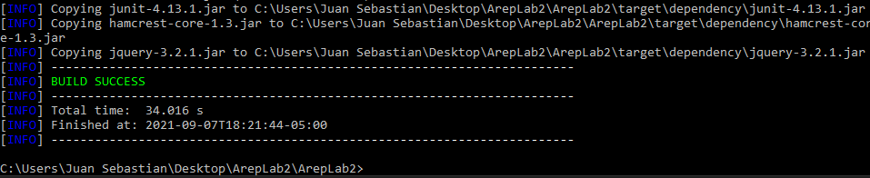
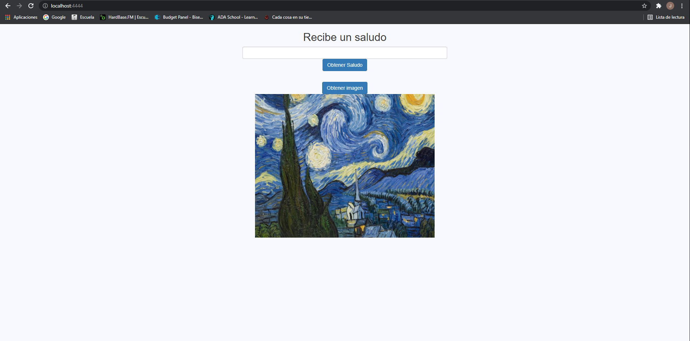

# Taller Clientes Y Servicios

Fecha: Septiembre 6 del 2021

Tercer Laboratorio de Arquitecturas Empresariales (AREP).

## CALENTAMIENTO (1H)

### EJERCICIO 1

Escriba un programa en el cual usted cree un objeto URL e imprima en pantalla cada uno de los componentes de una URL. Es decir , debe usar los siguientes métodos: getProtocol, getAuthority, getHost, getPort, getPath, getQuery, getFile, getRef. Asegúrese que ninguno imprima una cadena vacía, esto implica que la URL que use para su objeto debe contener datos suficientes.

### EJERCICIO 2

Escriba una aplicación browser que dada una URL lea datos de esa dirección y que los almacene en un archivo con el nombre resultado.html. Intente ver este archivo en el navegador. Su implementación debe ser un programa que reciba el parámetro de URL por medio de la línea de comandos.

### EJERCICIO 3

Usando sockets escriba un servidor que reciba un número y responda el cuadrado de este número. Escriba un cliente para probarlo y envíele una secuencia de 20 números.

### RETO 1

Escriba un servidor web que soporte múlltiples solicitudes seguidas (no concurrentes). El servidor debe retornar todos los archivos solicitados, incluyendo páginas html e imágenes. Construya un sitio web con javascript para probar su servidor. Despliegue su solución en Heroku. NO use frameworks web como Spark o Spring use solo Java y las librerías para manejo de la red.

### RETO 2 (AVANZADO)

Usando su  servidor y java (NO use frameworks web como Spark o Spring). Escriba un framework similar a Spark que le permita publicar servicios web "get" con funciones lambda y le permita acceder a recursoso estáticos como páginas, javascripts, imágenes, y CSSs. Cree una aplicación que conecte con una base de datos desde el servidor para probar su solución. Despliegue su solución en Heroku.

## Contenido

  - [Prerrequisitos](#prerrequisitos)
  - [Compilar](#compilar)
  - [Ejecutar](#ejecutar-de-forma-local)
  - [Uso](#uso)
  - [Diagramas](#diagramas)
  - [Resultados de las Pruebas](#resultados-de-las-pruebas)
  - [Generación de Javadoc](#generación-de-javadoc)
  - [Documentación en PDF realizada en LATEX](#documentación-en-PDF-realizada-en-LATEX)
  - [Autor](#autor)
  - [Licencia](#licencia)

## Prerrequisitos

Se utilizara **Maven** como una herramienta para la construcción y gestión del proyecto, el código fue desarrollado con lenguaje de programación **Java**; por lo tanto es necesario para la ejecución tener las dos herramientas en las versiones correctas.

  - Java versión 8 o superior
  
  - Maven versión 3.5 o superior 
    
## Compilar

Después clonar el proyecto se debe utilizar el comando `mvn package` para generar el ejecutable .jar con los .class compilados.

#### Ejecución con .jar

Se utilizó el comando `java -cp "target/areplab3-1.0-SNAPSHOT.jar;target/dependency/*" edu.eci.arep.App`.

#### Ejecución con .class

Se utilizó el comando `java -cp "target/classes;target/dependency/*" edu.eci.arep.App` para hacer la ejecución del proyecto.

Después de realizar la ejecución de las dos formas (.jar o .class), se accede de forma local dirigiéndose a la dirección http://localhost:4444.

## Uso

Para hacer uso de la aplicación se debe realizar lo siguiente:

1.  Abrir la aplicación de forma local o remota y escribir números separados por coma.

    URL Aplicación ejecutada de forma Local: http://localhost:4444

    URL Aplicación alojada de forma Remota con Heroku: https://lab2arepjuan.herokuapp.com/
    
    Esta pagina HTML contiene una imagen PNG y utiliza un archivo JS.
    
2.  La aplicación presenta el feature hacer click en el botón `Obtener Imagen`, el cual hara que la imagen desaparezca.

    

3.  La aplicación presenta el feature hacer click en el botón `Obtener Saludo`,el cual brindara un agradable saludo al nombre especificado.

    
    
    
4.  Para acceder directamente a la dirección get que solicita un servicio de bases de datos se pone la siguiente dirección en la URL.

    
    
5.  El servidor retorna archivos estáticos con las extensiones js,png y html.
      
    
    
    
    
    
    
6.  En caso de que los archivos objetivos no existan la aplicación mostrara los siguiente:

    

## Diagramas

Se presenta el diagrama de clases de la solución al laboratorio

La aplicación tiene tres componentes principales, FrontEnd, BackEnd y FirebaseDB.

A continuación se presentara el diagrama de componentes que forma parte de la solución.

La función lambda con la que se configuró este endpoint permite conectarse al componente **PersistenceServiceImpl**, este se conecta la base de datos Firebase para obtener el saludo que retorna junto con el nombre del usuario.

Por último se presenta el diagrama de arquitectura general que se utilizo para el desarrollo de la solución

## Resultados de las Pruebas

El programa fue probado con cinco pruebas unitarias de JUnit donde se contemplaron los siguientes casos:

  - Encontrar un archivo HTML.
  - Encontrar un archivo JS.
  - Encontrar un archivo que no exista.
  - Endpoint con NanoSpark.
  - Fallo Endpoint con NanoSpark.

## Documentación en PDF

La documentación se encuentra en el repositorio como un archivo .pdf

## Autor

  - **Juan Sebastián Muñoz Dorado**

